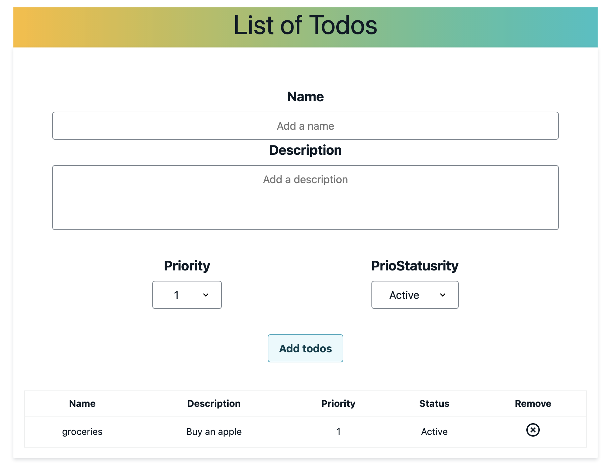

# Getting Started with Create React App

### Clone the repo
### run `npm i`
### run `npm start`

The app should render as following:

<table border="0">
 <tr>
    <td><b style="font-size:30px">Mobile</b></td>
    <td><b style="font-size:30px">Webapp</b></td>
 </tr>
 <tr>
    <td>.</td>
    <td></td>
 </tr>
</table>

Mobile

WebApp

